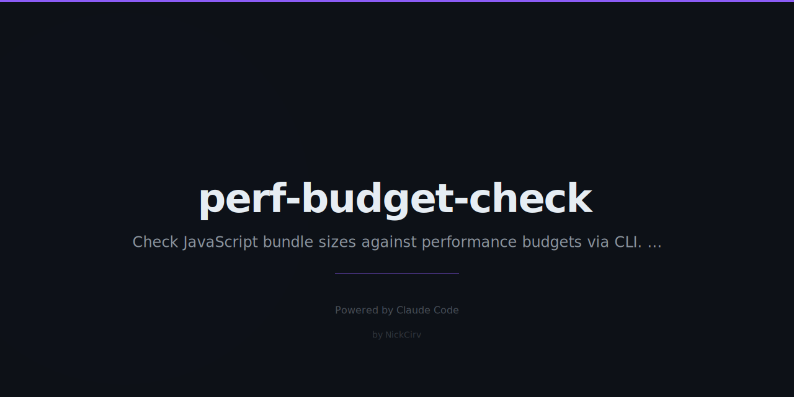

```
 ██████╗ ███████╗██████╗ ███████╗    ██████╗ ██╗   ██╗██████╗  ██████╗ ███████╗████████╗
 ██╔══██╗██╔════╝██╔══██╗██╔════╝    ██╔══██╗██║   ██║██╔══██╗██╔════╝ ██╔════╝╚══██╔══╝
 ██████╔╝█████╗  ██████╔╝█████╗      ██████╔╝██║   ██║██║  ██║██║  ███╗█████╗     ██║
 ██╔═══╝ ██╔══╝  ██╔══██╗██╔══╝      ██╔══██╗██║   ██║██║  ██║██║   ██║██╔══╝     ██║
 ██║     ███████╗██║  ██║██║         ██████╔╝╚██████╔╝██████╔╝╚██████╔╝███████╗   ██║
 ╚═╝     ╚══════╝╚═╝  ╚═╝╚═╝         ╚═════╝  ╚═════╝ ╚═════╝  ╚═════╝ ╚══════╝   ╚═╝

  ██████╗██╗  ██╗███████╗ ██████╗██╗  ██╗
 ██╔════╝██║  ██║██╔════╝██╔════╝██║ ██╔╝
 ██║     ███████║█████╗  ██║     █████╔╝
 ██║     ██╔══██║██╔══╝  ██║     ██╔═██╗
 ╚██████╗██║  ██║███████╗╚██████╗██║  ██╗
  ╚═════╝╚═╝  ╚═╝╚══════╝ ╚═════╝╚═╝  ╚═╝
```

# perf-budget-check

**Performance budgets for your CI pipeline — fail builds before slow pages ship.**

Zero external dependencies. Pure Node.js. Works with Webpack, Vite, Rollup, Parcel, or any build tool that produces output files.

[](https://nodejs.org)
[](LICENSE)
[](package.json)

---

## Quick Start

```bash
# Run without installing
npx perf-budget-check init
npx perf-budget-check check dist

# Or install globally
npm install -g perf-budget-check
perf-budget-check check dist
```

---

## Output

```
  perf-budget-check  scanning dist...

╔══════════════════════════════════╦════════════╦════════════╦════════════╦════════════╦══════════╗
║ File                             ║        Raw ║     Budget ║       Gzip ║    GBudget ║  Status  ║
╠══════════════════════════════════╬════════════╬════════════╬════════════╬════════════╬══════════╣
║ assets/main.a1b2c3.js            ║    148.32KB ║    150.00KB ║     48.11KB ║     50.00KB ║ ✅ PASS  ║
║ assets/vendor.chunk.js           ║    201.44KB ║    200.00KB ║     68.20KB ║     70.00KB ║ ❌ FAIL  ║
║ assets/app.css                   ║     44.80KB ║     50.00KB ║     12.30KB ║     20.00KB ║ ✅ PASS  ║
║ assets/analytics.js              ║    179.91KB ║    200.00KB ║     61.05KB ║     70.00KB ║ ⚠️ WARN  ║
║ index.html                       ║     18.20KB ║     20.00KB ║      6.40KB ║          — ║ ✅ PASS  ║
╚══════════════════════════════════╩════════════╩════════════╩════════════╩════════════╩══════════╝

  Checked: 5  │  Passed: 3  │  Warned: 1  │  Failed: 1

  Total raw: 592.67KB  │  Total gzip: 196.06KB
```

---

## Commands

| Command | Description |
|---------|-------------|
| `init` | Create `.perfbudget.json` with sensible defaults |
| `check [dir]` | Check files against budgets. Exits 1 if any fail |
| `history` | Show size trend over last N builds |
| `compare <base> <curr>` | Diff two build directories |
| `report` | Generate a report (table, json, github) |

### Options

| Flag | Default | Description |
|------|---------|-------------|
| `--config <file>` | `.perfbudget.json` | Path to config file |
| `--format table\|json\|github` | `table` | Output format |
| `--threshold <pct>` | `10` | Warn when within N% of budget |
| `--quiet`, `-q` | — | Only show failures (CI mode) |
| `--last <n>` | `10` | History: show last N entries |
| `--dir <dir>` | `dist` | Report: directory to scan |

---

## Configuration

Create `.perfbudget.json` in your project root (or run `perf-budget-check init`):

```json
{
  "budgets": [
    { "pattern": "*.js",      "maxSize": "200KB", "maxGzip": "70KB" },
    { "pattern": "main.*.js", "maxSize": "150KB", "maxGzip": "50KB" },
    { "pattern": "*.css",     "maxSize": "50KB",  "maxGzip": "20KB" },
    { "pattern": "*.html",    "maxSize": "20KB" },
    { "pattern": "*.wasm",    "maxSize": "500KB" }
  ],
  "history": {
    "enabled": true,
    "file": ".perf-history.json",
    "keep": 30
  }
}
```

### Pattern Matching

Patterns support `*` (any chars except `/`) and `**` (any chars including `/`):

| Pattern | Matches |
|---------|---------|
| `*.js` | Any `.js` file in the scanned directory |
| `main.*.js` | `main.abc123.js`, `main.bundle.js` |
| `**/*.js` | Any `.js` file, recursively |
| `vendor.chunk.js` | Exact filename |

More specific patterns override broader ones. The last matching budget wins.

### Size Units

`B`, `KB`, `MB`, `GB` — e.g. `"200KB"`, `"1.5MB"`, `"512B"`.

---

## CI Integration

### GitHub Actions

```yaml
name: Performance Budget Check

on: [push, pull_request]

jobs:
  perf-budget:
    runs-on: ubuntu-latest
    steps:
      - uses: actions/checkout@v4

      - name: Setup Node.js
        uses: actions/setup-node@v4
        with:
          node-version: '20'

      - name: Install dependencies & build
        run: npm ci && npm run build

      - name: Check performance budgets
        run: npx perf-budget-check check dist --format github

      - name: Upload size report
        if: always()
        run: npx perf-budget-check report --format json --dir dist > perf-report.json

      - uses: actions/upload-artifact@v4
        if: always()
        with:
          name: perf-report
          path: perf-report.json
```

GitHub Actions format (`--format github`) outputs native `::error` and `::warning` annotations that appear inline on the PR diff.

### GitLab CI

```yaml
perf-budget:
  stage: test
  script:
    - npm ci && npm run build
    - npx perf-budget-check check dist --quiet
  artifacts:
    when: always
    paths:
      - .perf-history.json
```

### CircleCI

```yaml
- run:
    name: Performance budget check
    command: npx perf-budget-check check dist --format json > perf.json
- store_artifacts:
    path: perf.json
```

---

## Size History

`perf-budget-check` automatically records build sizes to `.perf-history.json` after every `check` run.

```bash
perf-budget-check history --last 10
```

```
  Build Size History

┌──────────────────────────────┬──────────┬────────────┬────────────┬──────────┐
│ Timestamp                    │ Commit   │  Total Raw │   Total Gz │   Status │
├──────────────────────────────┼──────────┼────────────┼────────────┼──────────┤
│ 2026-03-01 14:22:01 UTC      │ a1b2c3d  │   588.10KB │   194.30KB │     PASS │
│ 2026-03-02 09:41:18 UTC      │ e4f5g6h  │   591.20KB │   195.70KB │     PASS │
│ 2026-03-03 11:15:44 UTC      │ i7j8k9l  │   592.67KB │   196.06KB │  1 FAIL  │
└──────────────────────────────┴──────────┴────────────┴────────────┴──────────┘
```

Commit hashes are captured automatically via `git rev-parse --short HEAD`. Add `.perf-history.json` to version control to track trends across branches.

---

## Compare Two Builds

```bash
perf-budget-check compare dist-main dist-feature-branch
```

```
  Compare: dist-main  →  dist-feature-branch

┌────────────────────────────────┬──────────────┬──────────────┬──────────────┬──────────┐
│ File                           │     Baseline │      Current │        Delta │   Change │
├────────────────────────────────┼──────────────┼──────────────┼──────────────┼──────────┤
│ main.a1b2c3.js                 │     144.20KB │     148.32KB │      +4.12KB │    +2.9% │
│ vendor.chunk.js                │     198.10KB │     201.44KB │      +3.34KB │    +1.7% │
│ app.css                        │      44.20KB │      44.80KB │      +0.60KB │    +1.4% │
└────────────────────────────────┴──────────────┴──────────────┴──────────────┴──────────┘
```

---

## Why perf-budget-check?

**The problem:** Bundle bloat is invisible until it's too late. A 50KB dependency sneaks in, then another, and suddenly your main bundle is 800KB and your Lighthouse score has collapsed. By the time you notice, untangling the changes is a pain.

**The solution:** Treat bundle size like a test. Set budgets. Fail the build when exceeded. Fix it before it ships.

**Why not Bundlesize, Size Limit, or Lighthouse CI?**

- **No external dependencies** — nothing to audit, no supply chain risk, no `node_modules` bloat
- **Works with any build tool** — scans output directories, not webpack internals
- **Accurate gzip estimates** — uses Node's built-in `zlib.gzipSync` at max compression, not guesses
- **Built-in trend history** — tracks every build, no external service needed
- **CI-native** — GitHub Actions annotations, exit codes, quiet mode

---

## Scanned File Types

`.js`, `.mjs`, `.cjs`, `.css`, `.html`, `.htm`, `.wasm`

`node_modules/` and hidden directories (`.git`, `.next`, etc.) are automatically excluded.

---

## Programmatic Use

```js
import { execFileSync } from 'child_process';

// Run check and capture output
try {
  execFileSync('perf-budget-check', ['check', 'dist', '--format', 'json'], {
    encoding: 'utf8',
    stdio: 'pipe',
  });
} catch (e) {
  const report = JSON.parse(e.stdout);
  console.log(`${report.summary.failed} budgets exceeded`);
  process.exit(1);
}
```

---

## License

MIT — see [LICENSE](LICENSE).
